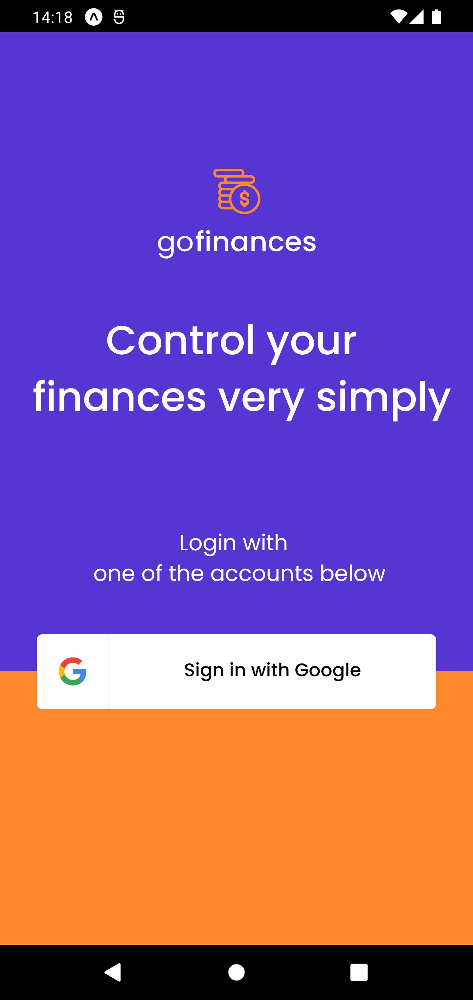
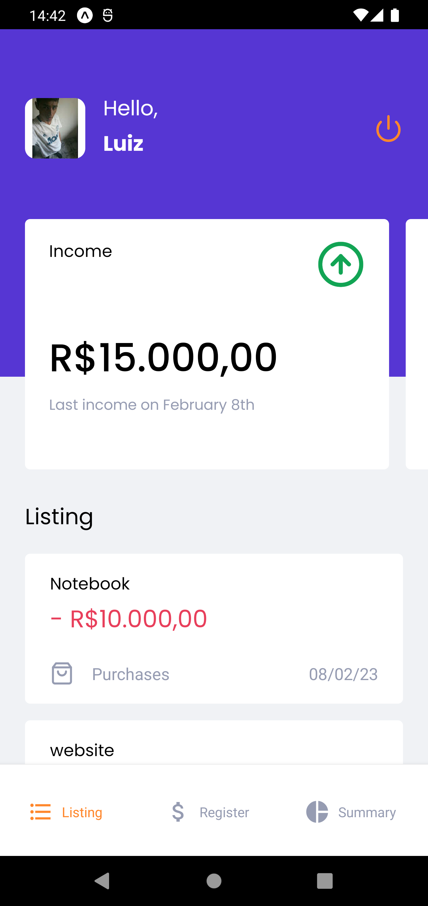
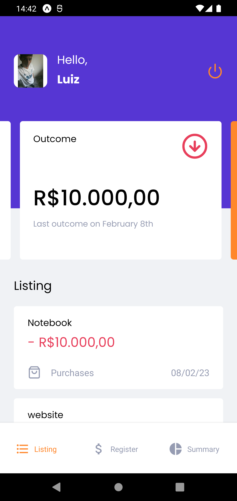
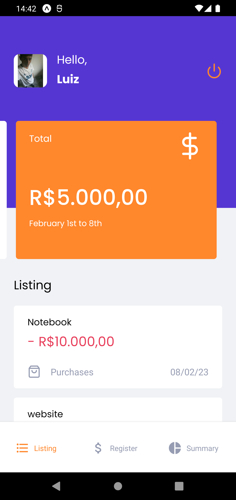
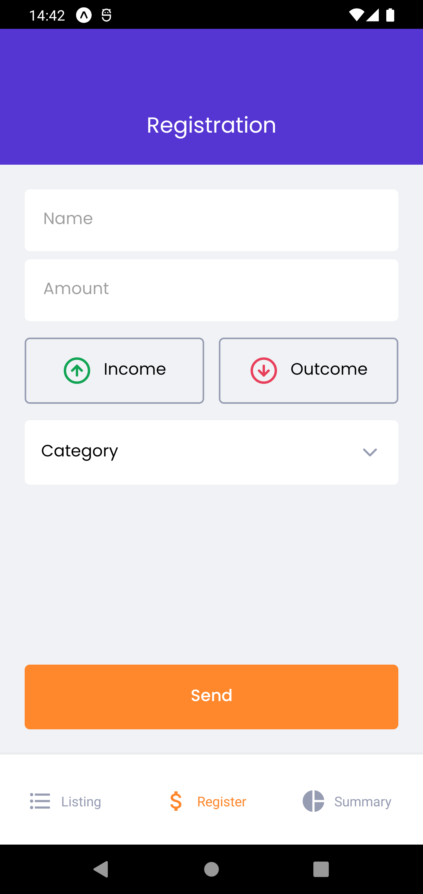
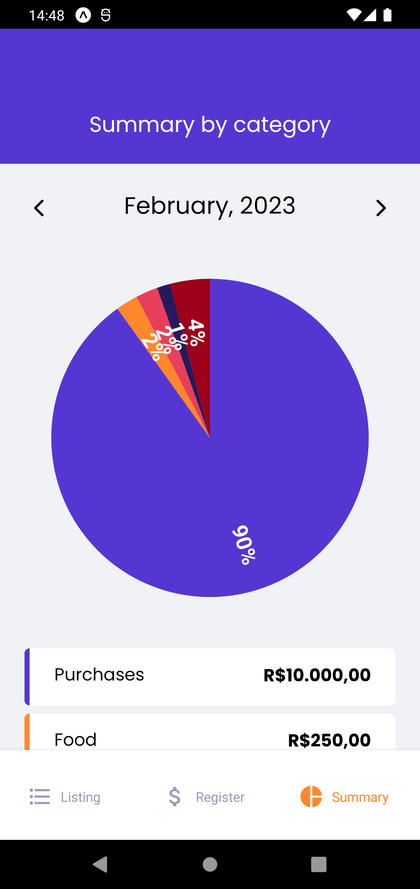
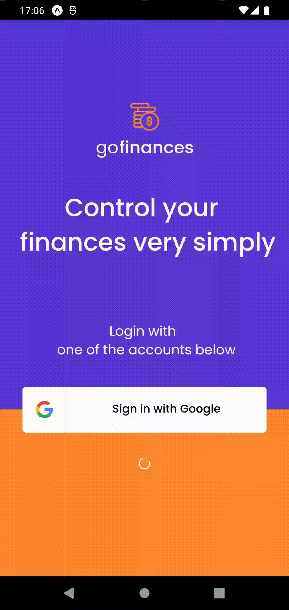

<p align="center">
  
  <br>
</p>
<h3 align="center">
Seu equilíbrio financeiro começa aqui!
</h3>

<p align="center">
  
  
  
  
</p>

<p align="center">
  <a href="#sobre">Sobre</a> •
  <a href="#gofinances">GoFinances</a> •
  <a href="#instalação">Instalação</a> •
  <a href="#tecnologias">Tecnologias</a> •
  <a href="#autor">Autor</a>  
</p>

## Sobre

Projeto desenvolvido durante o bootcamp Ignite da Rocketseat na trilha de React Native.

## GoFinances

O GoFinance é uma aplicação mobile feita com React Native e Typescript cujo objetivo é proporcionar à seus usuários um controle prático e centralizado sob suas finanças.

Ao acessar a aplicação, o usuário é direcionado para a tela de login aonde deve se autenticar com uma conta Google para acessar as funcionalidades do app:



Ao finalizar o login, o usuário será direcionado para a home da aplicação onde o usuário terá a sua disposição o botão de logoff, aos cards de entrada, saída e total das suas movimentações financeiras e mais abaixo uma lista com as transações realizadas pelo cliente, conforme podemos ver a seguir:

|               Entradas               |               Saídas                |              Total               |
| :----------------------------------: | :---------------------------------: | :------------------------------: |
|  |  |  |

Para que uma transação gere impacto nos cards da home e apareça na listagem é necessário que o usuário realize o registro da mesma. Para isso,basta clicar na aba `Register` no menu inferior da tela, para que o formulário de cadastro seja exibido. É nele onde o usuário irá informar um titulo, valor, indicar se trata-se de uma entrada ou saída e categorizar a transação. Abaixo podemos ver a tela de cadastro das transações:



Também no menu inferior, temos a aba `Resumo`, onde os gastos serão exibidos mensalmente através de um gráfico que categoriza as saídas e exibe em porcentagem quanto o usuário gasta por categoria:



Por fim, agora que todas as funcionalidades do app foram apresentadas deixarei a seguir um demonstração do app em funcionamento onde navego por todas as funcionalidades da aplicação:



## Instalação

Antes de começar, você vai precisar ter instalado em sua máquina as seguintes ferramentas:
[Git](https://git-scm.com) e [Node.js](https://nodejs.org/en/). Além disso é bom ter um editor para trabalhar com o código como [VSCode](https://code.visualstudio.com/).

### 📱 Rodando o App (Mobile)

```bash
# Clone este repositório
$ git clone git@github.com:SenhorSchiavon/gofinances.git

# Acesse a pasta do projeto no terminal/cmd
$ cd gofinances

# Instale as dependências
$ npm install
# Caso prefira usar o Yarn execute o comando abaixo
$ yarn

# Execute a aplicação
$ expo start

# Execute os testes
$ npm run test
# Caso prefira usar o Yarn execute o comando abaixo
$ yarn test

# Será aberto no terminal o menu do Expo onde poderá scanear o QR Code para executar o app diretamente no seu celular ou as opções de executar no emulador android ou iOS
```

## Tecnologias

[](https://skillicons.dev)

## Autor

<div align="center">

<h1>João Lucas Schiavon</h1>
<strong>Mobile Developer</strong>
<br/>
<br/>

<a href="https://linkedin.com/in/joão-lucas-schiavon-b0582519a/" target="_blank">

</a>

<a href="https://github.com/SenhorSchiavon" target="_blank">

</a>

<a href="mailto:schiavonjohn@gmail.com?subject=Fala%20Dev" target="_blank">

</a>


<br/>
<br/>
</div>
